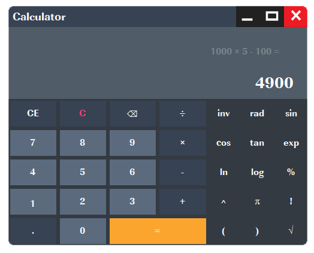

# ScientificCalculator
Simple and beautiful GUI program that implements the main Scientific Calculator Mathematical Operations.
* @author [Kareem Sherif](https://www.linkedin.com/in/kareem-sherif-4623b920b/)
* @version 1.0
* @since 2021-10-01

## Description
- GUI program that calculates different mathematical operations entered by the user.
- Input can be handled from user either, by keyboard or by clicking on window controls by mouse.
- The following operators is supported: + - / * ^ ! π inv [rad](https://en.wikipedia.org/wiki/Radian) [exp](https://en.wikipedia.org/wiki/Exponential_function) [logarithmicFunctions](https://en.wikipedia.org/wiki/Logarithm) [trigonometricFunctions](https://en.wikipedia.org/wiki/Trigonometric_functions).
- Decimal values and operations has been provided.
- Appropriate input validation has been made.
- Displaying messages to the user to explain any wrong inputs.

 `Coding is not finished, Only the UI.`

## Screenshots

